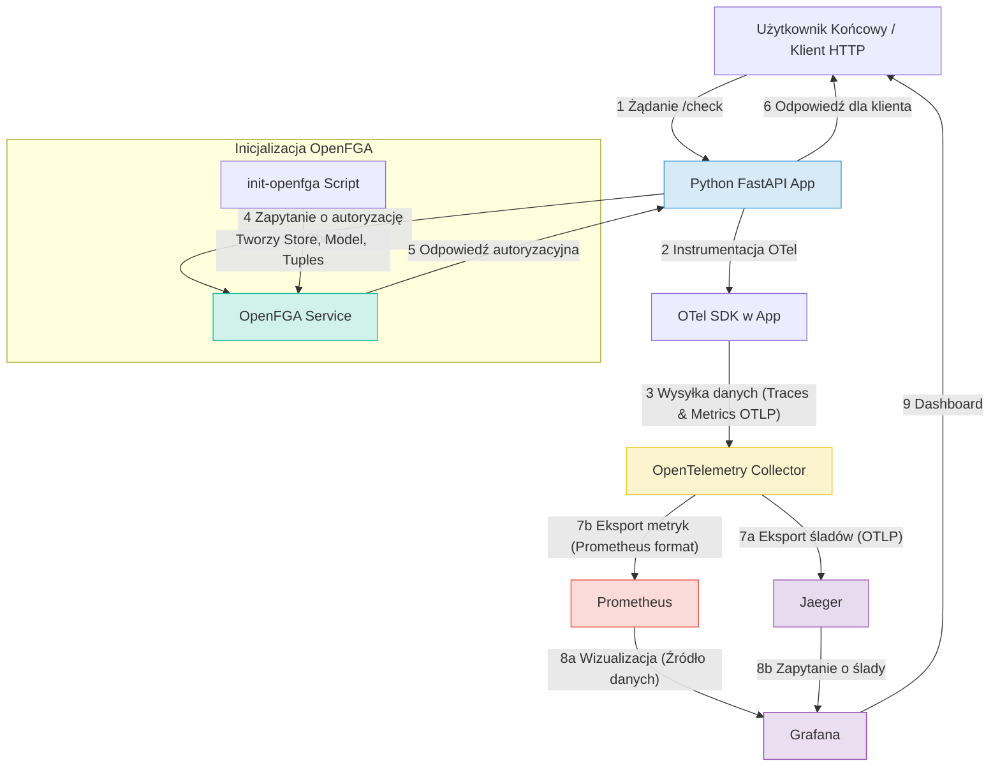
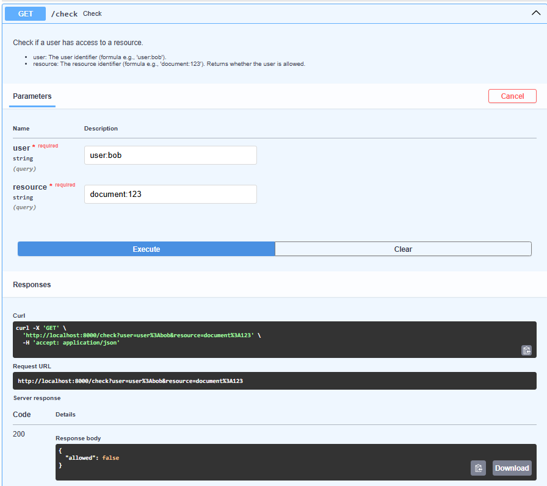
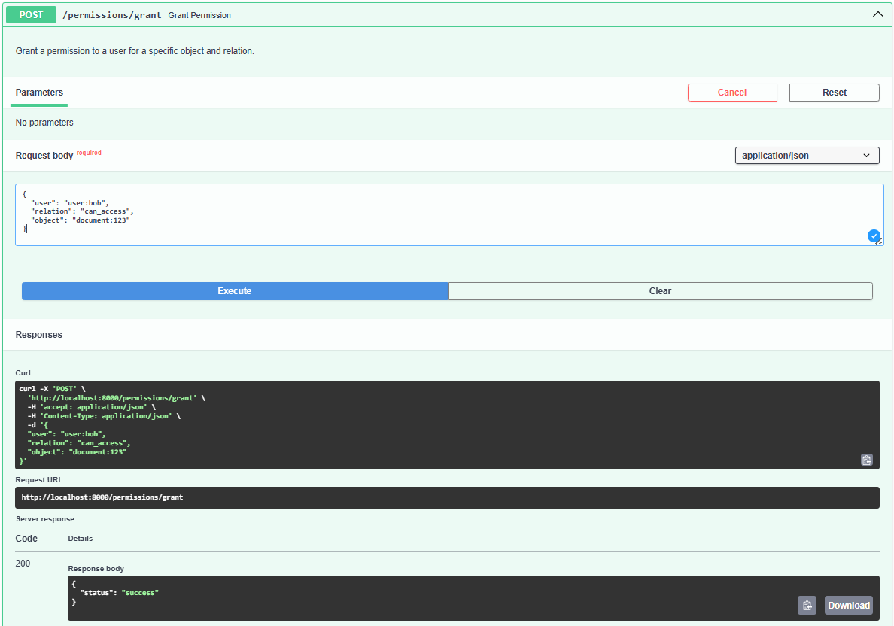
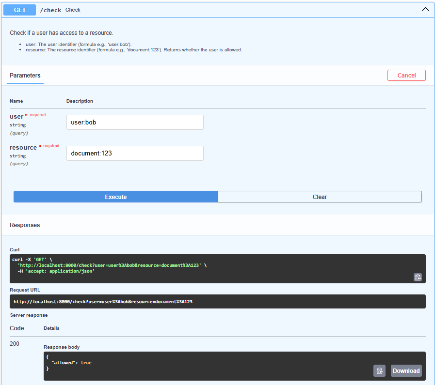
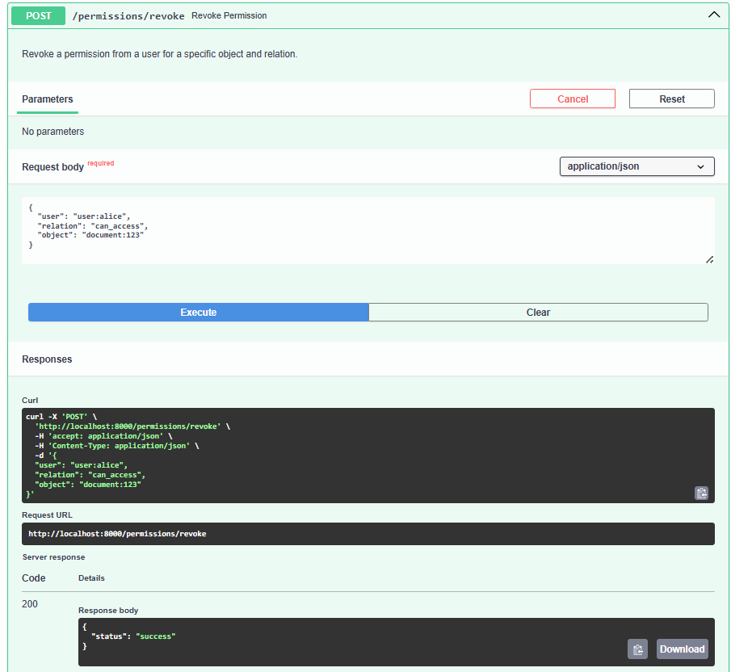
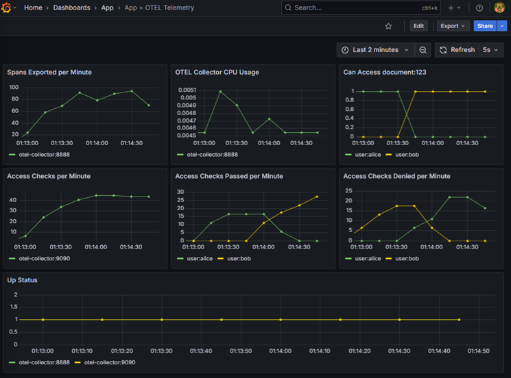
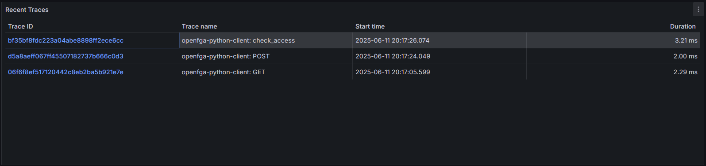

# OpenFGA-OTel

## Środowiska Udostępniania Usług: OpenFGA - OTel

**Autorzy:** Basia Wojtarowicz, Maciej Kopeć, Mateusz Knap, Tomasz Policht  
**Data:** Maj 2025

## 1. Wprowadzenie

Celem naszego projektu jest stworzenie dema, które zaprezentuje możliwości i cechy dwóch kluczowych technologii: **OpenFGA** – nowoczesnego systemu zarządzania autoryzacją opartego na modelu Zanzibar, oraz **OpenTelemetry (OTel)** – ustandaryzowanego frameworku do zbierania i eksportowania danych telemetrycznych (tracing, metrics, logs).

Scenariusz projektu opiera się na **systemie zarządzania dokumentami (lub uproszczonym systemie bankowym)**, gdzie użytkownicy mają różne poziomy dostępu do zasobów (dokumentów/kont). Pozwala to na przedstawienie rzeczywistego zastosowania wybranych technologii w kontekście bezpieczeństwa i monitoringu. Projekt nie powiela żadnego istniejącego w internecie rozwiązania, ale bazuje na ogólnodostępnych przykładach i dokumentacji, np.: [openFGA](https://github.com/openfga/sample-stores?fbclid=IwY2xjawKR1nxleHRuA2FlbQIxMAABHsJppZ4acY8LCBK6maNSxNt9_tu7k_jWHN-gTs0tglJkXIqhbqKXk8WucG95_aem_PaWmno4MIyNxFFq1ZlbVvw).

## 2. Podstawy teoretyczne i stos technologiczny

### 2.1 OpenFGA

**OpenFGA (Fine-Grained Authorization)** to otwartoźródłowa implementacja systemu autoryzacji, opracowana przez firmę Auth0 (obecnie część Okta), inspirowana systemem Google Zanzibar. OpenFGA umożliwia definiowanie złożonych polityk uprawnień z dużą dokładnością (fine-grained access control), opierając się na koncepcji grafu relacji. Wspiera modele takie jak **RBAC** (Role-Based Access Control) oraz **ABAC** (Attribute-Based Access Control) poprzez elastyczne modelowanie typów i relacji.

**Kluczowe cechy OpenFGA:**

-   **Modelowanie deklaratywne:** Definiowanie modeli uprawnień w czytelnym języku DSL (Domain Specific Language) lub formacie JSON.
-   **Relacje i Tuples:** Uprawnienia są definiowane jako relacje (np. `viewer`, `editor`) pomiędzy użytkownikami (lub grupami użytkowników) a obiektami (zasobami). Te konkretne przypisania nazywane są "tuples" (np. `user:alice` jest `viewer` dla `document:budget_q1`).
-   **Wysoka wydajność i skalowalność:** Zaprojektowany do obsługi dużej liczby zapytań o autoryzację.
-   **Sprawdzanie, listowanie i rozszerzanie:** API pozwala nie tylko na sprawdzanie dostępu (`Check`), ale także na listowanie obiektów, do których użytkownik ma dostęp (`ListObjects`), oraz użytkowników mających dostęp do obiektu (`ListUsers`).
-   **Integracja:** SDK dla popularnych języków programowania oraz API HTTP.

### 2.2 OpenTelemetry (OTel)

**OpenTelemetry** to zestaw narzędzi, API, SDK i bibliotek służących do generowania, zbierania i eksportowania danych telemetrycznych (metryk, logów i śladów) w celu analizy i zrozumienia wydajności oraz zachowania oprogramowania. Projekt jest rozwijany przez **CNCF** (Cloud Native Computing Foundation) i powstał z połączenia inicjatyw **OpenTracing** i **OpenCensus**.

**Główne typy danych telemetrycznych w Otel:**

-   **Ślady (Traces):** Reprezentują przepływ pojedynczego żądania przez różne komponenty systemu rozproszonego. Każdy ślad składa się z jednego lub więcej spanów, które reprezentują pojedynczą operację.
-   **Metryki (Metrics):** Agregowane pomiary liczbowe dotyczące wydajności i stanu systemu w czasie (np. liczba żądań na sekundę, zużycie CPU).
-   **Logi (Logs):** Ustandaryzowane zapisy zdarzeń występujących w aplikacji lub systemie.

Dzięki modularnej budowie Otel można łatwo zintegrować z aplikacjami, w tym mikroserwisowymi, oraz eksportować zebrane dane do różnych backendów analitycznych i wizualizacyjnych, takich jak **Jaeger**, **Prometheus**, **Grafana**, **Zipkin** czy **AWS CloudWatch**.

### 2.3 Pozostałe narzędzia

-   **Docker & Docker Compose:** Do konteneryzacji aplikacji i zarządzania wielokontenerowym środowiskiem dema.
-   **Prometheus:** System monitorowania i baza danych szeregów czasowych, używana do zbierania metryk.
-   **Grafana:** Platforma do wizualizacji i analizy danych, używana do wyświetlania metryk z Prometheus i potencjalnie śladów z Jaegera.
<!-- -   **Jaeger:** System do rozproszonego śledzenia (distributed tracing), umożliwiający wizualizację przepływu żądań. -->

## 3. Zarys demo

Pokażemy, jak aplikacja bankowa/e-commerce korzysta z OpenFGA do autoryzacji i za pomocą OpenTelemetry możemy obserwować kto i na jakiej podstawie uzyskał do niej dostęp lub nie.

### 3.1 Struktura

1. **Aplikacja testowa** (np. skrypt w Pythonie lub Go)
   - Wysyła zapytania do OpenFGA (czy `user:X` ma dostęp do `resource:Y`),
   - W zależności od odpowiedzi: wyświetla _"Access granted"_ / _"Access denied"_,
   - Dla każdego takiego zapytania — generuje trace/span w OpenTelemetry,
   - Wysyła metryki do OpenTelemetryCollector (sprawdzono czy `user:X` ma dostęp do `resource:Y` i czy odpowiedź była pozytywna/negatywna),

2. **OpenFGA**
   - Uruchomiony lokalnie (np. z repo sample-stores),
   - Załadowany model (z kontami bankowymi),
   - Wysłane tuple z demo (np. `"user:alice"` jest customer).

3. **OpenTelemetry**
   - Zainicjalizowane SDK (np. w Pythonie),

4. **Wizualna prezentacja efektu**
   - W Grafanie lub Prometheusie,
   - Prometheus zbiera dane z endpointu `/metrics` naszej aplikacji,
   - Dzięki temu, w Grafanie możemy zobaczyć:
     - ile zapytań zostało wykonanych,
     - jak wiele z nich zakończyło się sukcesem lub odmową,
     - czas odpowiedzi systemu,
     - ewentualne błędy lub przeciążenia,
     - kto i kiedy próbował uzyskać dostęp do jakiego zasobu.

<!-- ## 3. Koncepcja studium przypadku

### 3.1 Opis scenariusza

Nasze demo symuluje uproszczony **system zarządzania dokumentami w firmie**. W systemie tym użytkownicy mogą mieć różne role i uprawnienia do różnych typów dokumentów (np. "dokumenty publiczne", "raporty finansowe", "plany projektowe"). Chcemy pokazać:

1.  Jak OpenFGA zarządza autoryzacją: kto ma dostęp do jakich dokumentów i na jakiej podstawie (np. bezpośrednie nadanie, przynależność do grupy, rola).
2.  Jak OpenTelemetry pozwala obserwować te procesy:
    *   Śledzenie każdego żądania o autoryzację (kto, co, kiedy, wynik).
    *   Zbieranie metryk dotyczących liczby zapytań, odsetka udanych/nieudanych autoryzacji, czasu odpowiedzi systemu OpenFGA.
    *   Wizualizację tych danych w Grafanie.

### 3.2 Aktorzy i zasoby

-   **Aktorzy (Użytkownicy):**
    *   `user:alice` (np. analityk)
    *   `user:bob` (np. manager projektu)
    *   `user:charlie` (np. gość)
    *   `group:finance_team` (grupa użytkowników)
    *   `group:project_alpha_members` (grupa użytkowników)
-   **Zasoby (Dokumenty):**
    *   `document:public_info_page` (dokument publiczny)
    *   `document:finance_report_q1` (raport finansowy)
    *   `document:project_alpha_plan` (plan projektu)
-   **Relacje/Uprawnienia:**
    *   `can_view`: Użytkownik może odczytać dokument.
    *   `can_edit`: Użytkownik może modyfikować dokument.
    *   `member`: Użytkownik jest członkiem grupy.
    *   `owner`: Użytkownik jest właścicielem dokumentu (implikuje wszystkie inne uprawnienia).

### 3.3 Definicja reguł autoryzacji (przykładowy model OpenFGA)

Model zostanie zdefiniowany w pliku `openfga_model.json`. Przykładowe reguły:

-   Każdy użytkownik może wyświetlić `document:public_info_page`.
-   Członkowie grupy `group:finance_team` mogą wyświetlać i edytować `document:finance_report_q1`.
-   `user:alice` jest członkiem `group:finance_team`.
-   `user:bob` jest właścicielem `document:project_alpha_plan` i członkiem `group:project_alpha_members`.
-   Członkowie `group:project_alpha_members` mogą wyświetlać `document:project_alpha_plan`. -->

## 4. Podział ról w zespole

- Maciej Kopeć: wysyłanie, zbieranie i wyświetlanie metryk
- Mateusz Knap: Graf architektury, dokumentacja, wyświetlanie śladów
- Tomasz Policht: Początkowy setup projektu w Dockerze, opakowanie w kinda
- Basia Wojtarowicz: Dodanie API do dodawania/wycofywania ról (grant permissions/revoking permissions)

## 5. Architektura rozwiązania


### 5.1 Opis komponentów i przepływu danych

1.  **Użytkownik Końcowy / Klient HTTP (`UserClient`):** Inicjuje żądanie do aplikacji, np. poprzez `curl` lub przeglądarkę, aby sprawdzić dostęp do zasobu.
2.  **Aplikacja Python FastAPI (`App`):**
    *   Główna aplikacja demo, napisana w Pythonie z użyciem frameworka FastAPI.
    *   Udostępnia endpoint `/check?user=...&resource=...`.
    *   Integruje się z SDK OpenTelemetry (`OTelSDK`) w celu generowania śladów i metryk dla każdego żądania oraz dla operacji autoryzacyjnych.
    *   Komunikuje się z serwisem OpenFGA (`OpenFGA Service`) w celu weryfikacji uprawnień użytkownika do zasobu.
3.  **OpenFGA Service (`OpenFGA`):**
    *   Kontener z uruchomioną usługą OpenFGA.
    *   Przechowuje model autoryzacji i zdefiniowane relacje (tuples).
    *   Odpowiada na zapytania `Check` z aplikacji.
4.  **Skrypt Inicjalizacyjny OpenFGA (`init-openfga`):**
    *   Jednorazowy kontener uruchamiany przy starcie, który konfiguruje OpenFGA.
    *   Tworzy "store" (magazyn danych dla modelu i tupli).
    *   Wgrywa model autoryzacji (z `openfga_model.json`).
    *   Zapisuje początkowe relacje (tuples) definiujące uprawnienia.
5.  **OpenTelemetry Collector (`OTelCollector`):**
    *   Centralny punkt zbierania danych telemetrycznych.
    *   Odbiera ślady i metryki z aplikacji (`App`) przez protokół OTLP.
    *   Przetwarza dane (np. grupuje w partie).
    *   Eksportuje metryki do Prometheus w formacie oczekiwanym przez Prometheus.
    *   Eksportuje ślady do backendu śledzenia.
6.  **Prometheus:**
    *   Zbiera metryki z OpenTelemetry Collector (z endpointu `/metrics` wystawionego przez exporter `prometheus` w OTel Collector).
    *   Przechowuje metryki jako szeregi czasowe.
7.  **Jaeger:**
    *   Odbiera ślady (traces) z OpenTelemetry Collector.
    *   Umożliwia wizualizację i analizę rozproszonych śladów.
    *   Służy jako źródło danych dla Grafany do wyświetlania śladów.
8.  **Grafana:**
    *   Narzędzie do wizualizacji.
    *   Pobiera dane z Prometheus (metryki) i Jaeger (ślady) jako źródła danych.
    *   Wyświetla zintegrowane dashboardy z metrykami i śladami dotyczącymi działania aplikacji i procesu autoryzacji.

**Przepływ danych (dla żądania `/check`):**

1.  Klient wysyła żądanie HTTP GET do endpointu `/check` aplikacji FastAPI, podając `user` i `resource`.
2.  Aplikacja FastAPI odbiera żądanie. OTel SDK (automatyczna instrumentacja FastAPI i manualna dla klienta FGA) tworzy nowy ślad (span).
3.  Aplikacja przygotowuje zapytanie `Check` do OpenFGA. OTel SDK tworzy podrzędny span dla tej operacji.
4.  Aplikacja wysyła zapytanie `Check` do serwisu OpenFGA.
5.  OpenFGA przetwarza zapytanie na podstawie swojego modelu i tupli, zwracając `{"allowed": true/false}`.
6.  Aplikacja odbiera odpowiedź z OpenFGA. Span dla operacji FGA jest zamykany, wzbogacany o atrybuty (wynik, użytkownik, zasób). Metryka (`check_access_calls_total`) zbogacona o atrybuty (`user` i `resource`) jest inkrementowana.
7.  Aplikacja zwraca odpowiedź JSON do klienta. Główny span żądania jest zamykany.
8.  OTel SDK w aplikacji wysyła zebrane ślady i metryki (w tle, w partiach) do OpenTelemetry Collector.
9.  OTel Collector eksportuje metryki do Prometheus i ślady do Jaegera.
10. Prometheus okresowo scrapuje metryki z OTel Collector.
11. Użytkownik może przeglądać metryki i ślady w Grafanie (która odpytuje Prometheus i Jaegera).

**Przepływ danych (dla żądania `/permissions/revoke` i `/permissions/grant`):**

1.  Klient wysyła żądanie HTTP POST do endpointu `/permissions/revoke` / `/permissions/grant` aplikacji FastAPI, podając `user`, `resource`, `relation` (w naszym przypadku `can_access`).
2.  Aplikacja FastAPI odbiera żądanie. OTel SDK (automatyczna instrumentacja FastAPI i manualna dla klienta FGA) tworzy nowy ślad (span).
3.  Aplikacja przygotowuje zapytanie `Check` do OpenFGA. OTel SDK tworzy podrzędny span dla tej operacji.
4.  Aplikacja wysyła zapytanie `Write` do serwisu OpenFGA.
5.  OpenFGA dodaje do modelu odpowiedni wpis i zwraca status.
6.  Metryka (`can_access`) wzbogacona o atrybuty (`document` i `user`) jest inkrementowana lub dekrementowana w zależności od operacji (grant/revoke).
7.  OTel SDK w aplikacji wysyła zebrane ślady i metryki (w tle, w partiach) do OpenTelemetry Collector.
8.  OTel Collector eksportuje metryki do Prometheus.
9. Prometheus okresowo scrapuje metryki z OTel Collector.
10. Użytkownik może przeglądać metryki w Grafanie (która odpytuje Prometheus).

## 6. Wymagane oprogramowanie

Do uruchomienia projektu wymagane są następujące narzędzia:

1.  **Docker Engine:** Do budowania i uruchamiania kontenerów.
2.  **Docker Compose:** Do zarządzania wielokontenerową aplikacją zdefiniowaną w `docker-compose.yaml`.
3.  **Git:** Do sklonowania repozytorium projektu.
4.  **Przeglądarka internetowa** lub narzędzie typu `curl` do interakcji z aplikacją i przeglądania dashboardów.

## 7. Instalacja

### 7.1 Podejście Infrastructure as Code (Docker Compose)

1.  **Sklonuj repozytorium projektu:**
   ```bash
   git clone <URL_TWOJEGO_REPOZYTORIUM_NA_GITHUB>
   cd <NAZWA_KATALOGU_PROJEKTU>
   ```

2.  **Uruchom całą infrastrukturę za pomocą Docker Compose:**
   ```bash
   docker-compose up --build -d
   ```
   *   `--build`: Wymusza przebudowanie obrazów, jeśli zaszły zmiany (np. w `Dockerfile` lub kodzie aplikacji).
   *   `-d`: Uruchamia kontenery w tle (detached mode).

3.  **Sprawdź status kontenerów:**
   ```bash
   docker-compose ps
   ```
   Wszystkie serwisy (app, otel-collector, prometheus, grafana, openfga) powinny mieć status `Up` lub `running`. Kontener `init-openfga` powinien mieć status `Exited (0)` po pomyślnym wykonaniu.

4.  **Poczekaj chwilę** na pełne uruchomienie i ustabilizowanie się wszystkich serwisów, zwłaszcza na inicjalizację OpenFGA przez `init-openfga`.

## 8. Demo

### 8.1 Uruchomienie infrastruktury

Zostało to opisane w punkcie 7.1 ("Jak odtworzyć"). Po wykonaniu `docker-compose up -d`, cała infrastruktura jest gotowa.

### 8.2 Przygotowanie danych (inicjalizacja OpenFGA)

Kontener `init-openfga` automatycznie wykonuje następujące kroki:
1.  Tworzy "store" w OpenFGA.
2.  Wgrywa model autoryzacji z `openfga_model.json`.
3.  Zapisuje początkowe tuple, np. `user:alice` ma relację `can_access` do `document:123`.

Możesz zmodyfikować `openfga_model.json` i listę tupli w `init_openfga.sh`, aby stworzyć bardziej złożony scenariusz zgodny z opisaną koncepcją studium przypadku (np. z użytkownikami, grupami i różnymi typami dokumentów).

### 8.3 Procedura wykonania (generowanie ruchu)

Po uruchomieniu systemów, można wysyłać żądania do aplikacji, aby przetestować autoryzację i obserwować generowane dane telemetryczne.

1.  **Sprawdź dostęp dla `alice` do `document:123` (powinno być dozwolone):**
    Otwórz w przeglądarce lub użyj `curl`:
    ```bash
    curl "http://localhost:8000/check?user=user:alice&resource=document:123"
    ```
    Oczekiwana odpowiedź: `{"allowed":true}`

2.  **Sprawdź dostęp dla `bob` do `document:123` (powinno być zabronione):**
    ```bash
    curl "http://localhost:8000/check?user=user:bob&resource=document:123"
    ```
    Oczekiwana odpowiedź: `{"allowed":false}`

3.  **Dodaj uprawnienia (dostęp) do `document:123` dla użytkownika `user:bob`:**
    ```bash
    curl -X POST http://localhost:8000/permissions/grant
      -H "Content-Type: application/json"
      -d '{
      "user": "user:bob",
      "relation": "can_access",
      "object": "document:123"
      }'
    ```
    lub analogicznie w FastAPI Swagger UI wpisując w ciele zapytania POST:
   ```json
     {
      "user": "user:bob",
      "relation": "can_access",
      "object": "document:123"
      }
   ```
    Oczekiwana odpowiedź: `{"status":"success"}`
   
5.  **Usuń uprawnienia (dostęp) do `document:123` użytkownika `user:bob`:**
    ```bash
      curl -X POST http://localhost:8000/permissions/revoke
      -H "Content-Type: application/json"
      -d '{
      "user": "user:bob",
      "relation": "can_access",
      "object": "document:123"
      }'
    ```
   lub analogicznie w FastAPI Swagger UI wpisując w ciele zapytania POST:
   ```json
      {
      "user": "user:bob",
      "relation": "can_access",
      "object": "document:123"
      }
   ```
    Oczekiwana odpowiedź: `{"status":"success"}`
    
6. Teraz ponownie możesz sprawdzić status uprawnień zgodnie z punktem 2.

### 8.4 Prezentacja wyników

1.  **Grafana (Metryki):**
    *   Otwórz Grafanę w przeglądarce: `http://localhost:3000`
    *   Zaloguj się (domyślnie: użytkownik `admin`, hasło `admin` - zdefiniowane w `docker-compose.yaml`).
    *   Przejdź do zakładki "Dashboards" (lub "Przeglądaj pulpity").
    *   Odszukaj i otwórz zaimportowany dashboard "App + OTEL Telemetry" (lub podobnie nazwany, z folderu "App").
    *   Obserwuj panele pokazujące:
        *   Liczbę wyeksportowanych spanów.
        *   Użycie CPU przez OTel Collector.
        *   Całkowitą liczbę zapytań o autoryzację (`check_access_calls_total`).
        *   Liczbę zapytań zakończonych sukcesem (`allowed="True"`).
        *   Liczbę zapytań zakończonych odmową (`allowed="False"`).
        *   Status "Up" dla monitorowanych serwisów.
        *   Możesz dostosować zakres czasu, aby zobaczyć dane z ostatniej aktywności.

2.  **Logi OpenTelemetry Collector:**
    Aby zobaczyć ślady eksportowane do `debug`:
    ```bash
    docker-compose logs otel-collector
    ```
    W logach powinny pojawić się szczegółowe informacje o każdym spanie. Będzie to mniej czytelne niż w Jaegerze, ale pokaże, że ślady są generowane.

## 9. Prezentacja działania dema

### 9.1. Żądania Fast API
- Sprawdzenie czy użytkownik `user:bob` ma dostęp do `document:123`

- Nadanie uprawnień użytkownikowi `user:bob` do `document:123`

- Ponowne sprawdzenie czy użytkownik `user:bob` ma dostęp do `document:123`

- Usunięcie uprawnień użytkownikowi `user:alice` do `document:123`


### 9.2. Metryki prezentowane w Grafanie:
- Sprawdzono dostęp dla `user:bob` / `user:alice` do dokumentu `document:123` przed zmianą uprawnień.
- Użytkownikowi `user:bob` nadano uprawnnienia, a użytkownikowi `user:alice` zabrano.
- Ponownie sprawdzono dostęp dla `user:bob` / `user:alice` do dokumentu `document:123` po zmianie uprawnień.



## 10. Szczegóły Implementacji Technicznej

Poniżej znajduje się szczegółowe omówienie kluczowych elementów konfiguracji i implementacji, które stoją za działaniem dema.

### 10.1. Konfiguracja Kolektora OpenTelemetry

Kolektor OpenTelemetry (`otel-collector`) pełni w naszej architekturze rolę centralnego agenta do zbierania, przetwarzania i eksportowania danych telemetrycznych. Jego działanie jest w pełni zdefiniowane w plikach `docker-compose.yaml` oraz `otel-collector-config.yaml`.

#### Definicja w Docker Compose

W pliku `docker-compose.yaml` serwis `otel-collector` jest zdefiniowany następująco:

```yaml
  otel-collector:
    image: otel/opentelemetry-collector:latest
    command: ["--config=/etc/otel-collector-config.yaml"]
    volumes:
      - ./otel-collector-config.yaml:/etc/otel-collector-config.yaml
    ports:
      - "4318:4318"  # Odbiornik OTLP/HTTP
      - "9090:9090"  # Exporter dla Prometheus (metryki aplikacji)
      - "8888:8888"  # Metryki wewnętrzne kolektora
    depends_on:
      - jaeger
    restart: on-failure
```

-   **`image`**: Używamy oficjalnego obrazu OpenTelemetry Collector.
-   **`command`**: Wskazujemy na plik konfiguracyjny, który został zamontowany w kontenerze.
-   **`volumes`**: Montujemy lokalny plik `otel-collector-config.yaml` do wnętrza kontenera, co pozwala na łatwą modyfikację konfiguracji bez potrzeby przebudowywania obrazu.

#### Konfiguracja potoków w `otel-collector-config.yaml`

Konfiguracja kolektora opiera się na trzech głównych sekcjach: `receivers`, `exporters` i `pipelines`.

1.  **Receivers (Odbiorniki):** Definiują, jak kolektor przyjmuje dane. W naszym projekcie używamy odbiornika **`otlp`** skonfigurowanego do przyjmowania danych w protokole OpenTelemetry Protocol przez HTTP na porcie `4318`.

    ```yaml
    receivers:
      otlp:
        protocols:
          http:
            endpoint: "0.0.0.0:4318"
    ```

2.  **Exporters (Eksportery):** Określają, dokąd kolektor ma wysyłać przetworzone dane. Zdefiniowaliśmy trzy eksportery:

    ```yaml
    exporters:
      prometheus:
        endpoint: "0.0.0.0:9090"
      debug:
        verbosity: detailed
      otlphttp:
        endpoint: "http://jaeger:4318"
        tls:
          insecure: true
    ```
    - **`prometheus`**: Udostępnia metryki w formacie, który może być pobierany przez serwer Prometheus.
    - **`debug`**: Wypisuje wszystkie otrzymane dane telemetryczne na standardowe wyjście, co jest przydatne do celów deweloperskich.
    - **`otlphttp`**: Wysyła ślady (traces) do serwisu **Jaeger** za pomocą protokołu OTLP/HTTP.

3.  **Service (Pipelines):** Łączą odbiorniki, procesory (używamy `batch` do grupowania danych) i eksportery w potoki przetwarzania.

    ```yaml
    service:
      pipelines:
        traces:
          receivers: [otlp]
          processors: [batch]
          exporters: [debug, otlphttp]
        metrics:
          receivers: [otlp]
          processors: [batch]
          exporters: [prometheus]
    ```
    -   **Potok `traces`**: Odbiera ślady, grupuje je, a następnie wysyła do `debug` i do `Jaeger`.
    -   **Potok `metrics`**: Odbiera metryki, grupuje je, a następnie eksportuje do `prometheus`.


### 10.2. Instrumentacja Aplikacji

Instrumentacja to proces dodawania kodu do aplikacji w celu generowania danych telemetrycznych. W naszym projekcie połączyliśmy instrumentację automatyczną z manualną.

#### Instrumentacja Automatyczna

W pliku `app/otel.py` inicjujemy automatyczną instrumentację dla biblioteki `requests`:

```python
# app/otel.py
from opentelemetry.instrumentation.requests import RequestsInstrumentor

# ... wewnątrz funkcji init_telemetry ...
RequestsInstrumentor().instrument()
```

Dzięki tej jednej linii, każda operacja HTTP wykonana za pomocą biblioteki `requests` (np. zapytania do OpenFGA) automatycznie generuje span w ramach istniejącego śladu, śledząc czas trwania i status zapytania.

#### Instrumentacja Manualna

Manualna instrumentacja daje pełną kontrolę nad tworzonymi danymi. Wykorzystaliśmy ją do stworzenia kluczowych, biznesowych metryk i śladów.

**Tworzenie Śladów (Traces) w `app/fga_client.py`:**

```python
# app/fga_client.py
from opentelemetry import trace

tracer = trace.get_tracer(__name__)

def check_access(user, resource):
    with tracer.start_as_current_span("check_access") as span:
        # ... logika zapytania do OpenFGA ...
        allowed = response.json().get("allowed", False)
        span.set_attribute("check.allowed", str(allowed))
        span.set_attribute("user", user)
        span.set_attribute("resource", resource)
        # ...
        return allowed
```
-   Tworzymy dedykowany span o nazwie `check_access` dla operacji sprawdzania uprawnień.
-   Do spana dodajemy niestandardowe **atrybuty** (`check.allowed`, `user`, `resource`), które wzbogacają ślad o kontekst biznesowy, umożliwiając łatwe filtrowanie w Jaegerze.

**Tworzenie Metryk (Metrics) w `app/fga_client.py` i `main.py`:**

Używamy dwóch rodzajów metryk: **Counter** (`check_access_calls_total`) do zliczania wywołań oraz **UpDownCounter** (`can_access`) do śledzenia stanu uprawnień w czasie rzeczywistym.

```python
# app/fga_client.py
check_access_counter = meter.create_counter("check_access_calls", ...)
# ... wewnątrz check_access ...
check_access_counter.add(1, {"allowed": str(allowed), "user": user, ...})

# app/main.py - w endpoint'cie grant_permission
can_access.add(1, {"user": req.user, ...})

# app/main.py - w endpoint'cie revoke_permission
can_access.add(-1, {"user": req.user, ...})
```
-   **Counter** jest inkrementowany o `1` przy każdym sprawdzeniu dostępu, z etykietami umożliwiającymi agregację danych w Grafanie.
-   **UpDownCounter** jest zwiększany o `1` przy nadaniu uprawnienia i zmniejszany o `1` przy jego odebraniu, co pozwala monitorować aktualny stan polityk bezpieczeństwa.

### 10.3. Konfigurowanie OpenTelemetry SDK

Konfiguracja SDK OTel w aplikacji Python odbywa się w pliku `app/otel.py`, w funkcji `init_telemetry`.

```python
# app/otel.py
def init_telemetry(service_name):
    # 1. Definicja zasobu - identyfikacja serwisu
    resource = Resource.create(attributes={"service.name": service_name})

    # 2. Konfiguracja potoku dla śladów (Traces)
    provider = TracerProvider(resource=resource)
    trace.set_tracer_provider(provider)
    exporter = OTLPSpanExporter(endpoint="http://otel-collector:4318/v1/traces")
    trace.get_tracer_provider().add_span_processor(BatchSpanProcessor(exporter))
    
    # 3. Konfiguracja potoku dla metryk (Metrics)
    metrics_exporter = OTLPMetricExporter(endpoint="http://otel-collector:4318/v1/metrics")
    metric_reader = PeriodicExportingMetricReader(metrics_exporter, ...)
    m_provider = MeterProvider(resource=resource, metric_readers=[metric_reader])
    metrics.set_meter_provider(m_provider)

    # 4. Uruchomienie automatycznej instrumentacji
    RequestsInstrumentor().instrument()
```

Kluczowe kroki to:
1.  **`Resource`**: Każda dana telemetryczna jest tagowana atrybutem `service.name`.
2.  **Konfiguracja Traces**: `TracerProvider` jest konfigurowany z `OTLPSpanExporter`, który wysyła spany do kolektora.
3.  **Konfiguracja Metrics**: `MeterProvider` jest konfigurowany z `OTLPMetricExporter`, który wysyła metryki do tego samego kolektora.
4.  **Inicjalizacja Instrumentacji**: Na końcu wywoływana jest automatyczna instrumentacja.

## 11. Wnioski

Analiza projektu i jego implementacji pozwala wyciągnąć następujące wnioski:

1.  **Pełna Obserwowalność Procesu Autoryzacji**: Połączenie OpenFGA i OpenTelemetry zapewnia kompletny wgląd w działanie systemu autoryzacji. **Traces** (ślady) pozwalają na szczegółową analizę pojedynczego żądania o dostęp (kto pytał, o co, jaki był wynik, ile to trwało), co jest nieocenione przy debugowaniu problemów z uprawnieniami.
2.  **Monitoring Biznesowy i Bezpieczeństwa**: **Metrics** (metryki) takie jak `check_access_calls_total` i `can_access` przenoszą monitoring z warstwy czysto technicznej (użycie CPU, pamięć) na warstwę biznesową. Możemy tworzyć alerty na podstawie anomalii (np. nagły wzrost odmów dostępu) i wizualizować w czasie rzeczywistym, kto ma dostęp do kluczowych zasobów.
3.  **Modułowość i Centralizacja**: Architektura oparta na Kolektorze OTel jest wysoce skalowalna i elastyczna. Aplikacja nie musi wiedzieć, gdzie docelowo trafią jej dane (Jaeger, Prometheus) – wysyła je do jednego miejsca (kolektora), co upraszcza konfigurację i umożliwia łatwe dodawanie nowych backendów w przyszłości.
4.  **Separacja Odpowiedzialności**: Projekt doskonale ilustruje zasadę separacji odpowiedzialności. OpenFGA zarządza logiką autoryzacji, aplikacja FastAPI logiką biznesową, a system OpenTelemetry zapewnia obserwowalność. Taki podział ułatwia rozwój, testowanie i utrzymanie każdego z komponentów.
5.  **Moc Deklaratywnej Konfiguracji**: Zarówno model autoryzacji w OpenFGA (`openfga_model.json`), jak i konfiguracja infrastruktury (`docker-compose.yaml`) oraz potoków telemetrycznych (`otel-collector-config.yaml`) są zdefiniowane w sposób deklaratywny. Ułatwia to zrozumienie systemu, automatyzację wdrożeń i zarządzanie zmianami.

## 12. Bibliografia
-   [OpenFGA Documentation](https://openfga.dev/docs/)
-   [OpenTelemetry Documentation](https://opentelemetry.io/docs/)
-   [Python Opentelemetry Documentation](https://opentelemetry-python.readthedocs.io/)
-   [FastAPI Documentation](https://fastapi.tiangolo.com/)
-   [Docker Documentation](https://docs.docker.com/)
-   [Kind Documentation](https://kind.sigs.k8s.io/)
