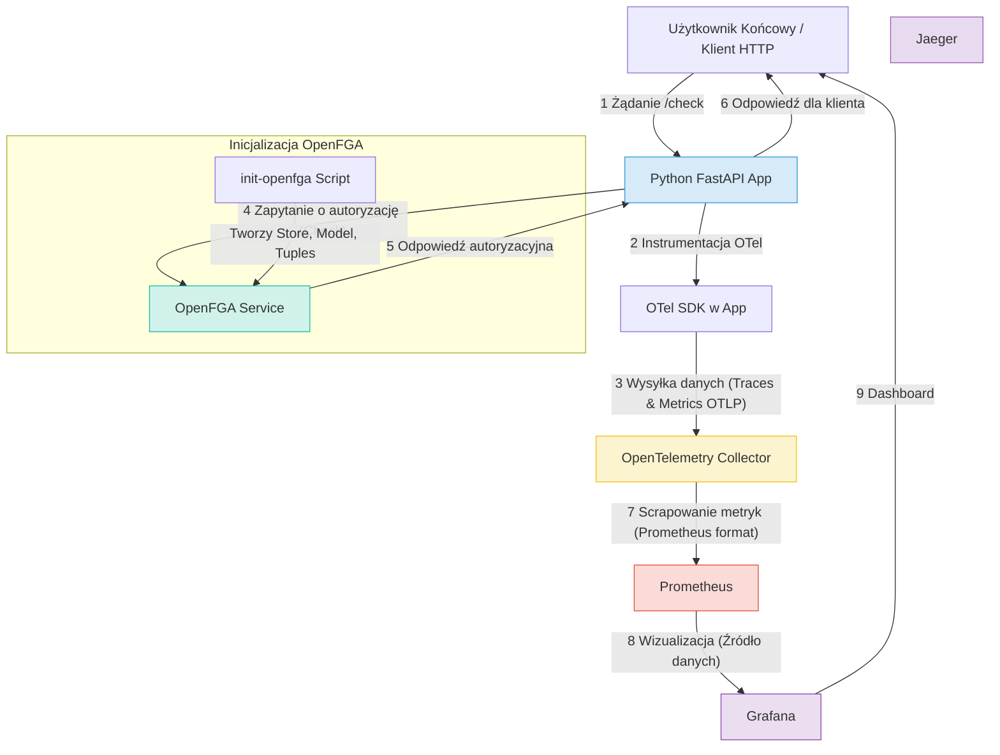

# OpenFGA-OTel

## Środowiska Udostępniania Usług: OpenFGA - OTel

**Autorzy:** Basia Wojtarowicz, Maciej Kopeć, Mateusz Knap, Tomasz Policht  
**Data:** Maj 2025

## 1. Wprowadzenie

Celem naszego projektu jest stworzenie dema, które zaprezentuje możliwości i cechy dwóch kluczowych technologii: **OpenFGA** – nowoczesnego systemu zarządzania autoryzacją opartego na modelu Zanzibar, oraz **OpenTelemetry (OTel)** – ustandaryzowanego frameworku do zbierania i eksportowania danych telemetrycznych (tracing, metrics, logs).

Scenariusz projektu opiera się na **systemie zarządzania dokumentami (lub uproszczonym systemie bankowym)**, gdzie użytkownicy mają różne poziomy dostępu do zasobów (dokumentów/kont). Pozwala to na przedstawienie rzeczywistego zastosowania wybranych technologii w kontekście bezpieczeństwa i monitoringu. Projekt nie powiela żadnego istniejącego w internecie rozwiązania, ale bazuje na ogólnodostępnych przykładach i dokumentacji, np.: [openFGA](https://github.com/openfga/sample-stores?fbclid=IwY2xjawKR1nxleHRuA2FlbQIxMAABHsJppZ4acY8LCBK6maNSxNt9_tu7k_jWHN-gTs0tglJkXIqhbqKXk8WucG95_aem_PaWmno4MIyNxFFq1ZlbVvw).

## 2. Podstawy teoretyczne i stos technologiczny

### 2.1 OpenFGA

**OpenFGA (Fine-Grained Authorization)** to otwartoźródłowa implementacja systemu autoryzacji, opracowana przez firmę Auth0 (obecnie część Okta), inspirowana systemem Google Zanzibar. OpenFGA umożliwia definiowanie złożonych polityk uprawnień z dużą dokładnością (fine-grained access control), opierając się na koncepcji grafu relacji. Wspiera modele takie jak **RBAC** (Role-Based Access Control) oraz **ABAC** (Attribute-Based Access Control) poprzez elastyczne modelowanie typów i relacji.

**Kluczowe cechy OpenFGA:**

-   **Modelowanie deklaratywne:** Definiowanie modeli uprawnień w czytelnym języku DSL (Domain Specific Language) lub formacie JSON.
-   **Relacje i Tuples:** Uprawnienia są definiowane jako relacje (np. `viewer`, `editor`) pomiędzy użytkownikami (lub grupami użytkowników) a obiektami (zasobami). Te konkretne przypisania nazywane są "tuples" (np. `user:alice` jest `viewer` dla `document:budget_q1`).
-   **Wysoka wydajność i skalowalność:** Zaprojektowany do obsługi dużej liczby zapytań o autoryzację.
-   **Sprawdzanie, listowanie i rozszerzanie:** API pozwala nie tylko na sprawdzanie dostępu (`Check`), ale także na listowanie obiektów, do których użytkownik ma dostęp (`ListObjects`), oraz użytkowników mających dostęp do obiektu (`ListUsers`).
-   **Integracja:** SDK dla popularnych języków programowania oraz API HTTP.

### 2.2 OpenTelemetry (OTel)

**OpenTelemetry** to zestaw narzędzi, API, SDK i bibliotek służących do generowania, zbierania i eksportowania danych telemetrycznych (metryk, logów i śladów) w celu analizy i zrozumienia wydajności oraz zachowania oprogramowania. Projekt jest rozwijany przez **CNCF** (Cloud Native Computing Foundation) i powstał z połączenia inicjatyw **OpenTracing** i **OpenCensus**.

**Główne typy danych telemetrycznych w Otel:**

-   **Ślady (Traces):** Reprezentują przepływ pojedynczego żądania przez różne komponenty systemu rozproszonego. Każdy ślad składa się z jednego lub więcej spanów, które reprezentują pojedynczą operację.
-   **Metryki (Metrics):** Agregowane pomiary liczbowe dotyczące wydajności i stanu systemu w czasie (np. liczba żądań na sekundę, zużycie CPU).
-   **Logi (Logs):** Ustandaryzowane zapisy zdarzeń występujących w aplikacji lub systemie.

Dzięki modularnej budowie Otel można łatwo zintegrować z aplikacjami, w tym mikroserwisowymi, oraz eksportować zebrane dane do różnych backendów analitycznych i wizualizacyjnych, takich jak **Jaeger**, **Prometheus**, **Grafana**, **Zipkin** czy **AWS CloudWatch**.

### 2.3 Pozostałe narzędzia

-   **Docker & Docker Compose:** Do konteneryzacji aplikacji i zarządzania wielokontenerowym środowiskiem dema.
-   **Prometheus:** System monitorowania i baza danych szeregów czasowych, używana do zbierania metryk.
-   **Grafana:** Platforma do wizualizacji i analizy danych, używana do wyświetlania metryk z Prometheus i potencjalnie śladów z Jaegera.
<!-- -   **Jaeger:** System do rozproszonego śledzenia (distributed tracing), umożliwiający wizualizację przepływu żądań. -->

## 3. Zarys demo

Pokażemy, jak aplikacja bankowa/e-commerce korzysta z OpenFGA do autoryzacji i za pomocą OpenTelemetry możemy obserwować kto i na jakiej podstawie uzyskał do niej dostęp lub nie.

### 3.1 Struktura

1. **Aplikacja testowa** (np. skrypt w Pythonie lub Go)
   - Wysyła zapytania do OpenFGA (czy `user:X` ma dostęp do `resource:Y`),
   - W zależności od odpowiedzi: wyświetla _"Access granted"_ / _"Access denied"_,
   - Dla każdego takiego zapytania — generuje trace/span w OpenTelemetry,
   - Wysyła metryki do OpenTelemetryCollector (sprawdzono czy `user:X` ma dostęp do `resource:Y` i czy odpowiedź była pozytywna/negatywna),

2. **OpenFGA**
   - Uruchomiony lokalnie (np. z repo sample-stores),
   - Załadowany model (z kontami bankowymi),
   - Wysłane tuple z demo (np. `"user:alice"` jest customer).

3. **OpenTelemetry**
   - Zainicjalizowane SDK (np. w Pythonie),
   - Export danych do Jaegera.

4. **Wizualna prezentacja efektu**
   - W Grafanie lub Prometheusie,
   - Prometheus zbiera dane z endpointu `/metrics` naszej aplikacji,
   - Dzięki temu, w Grafanie możemy zobaczyć:
     - ile zapytań zostało wykonanych,
     - jak wiele z nich zakończyło się sukcesem lub odmową,
     - czas odpowiedzi systemu,
     - ewentualne błędy lub przeciążenia,
     - kto i kiedy próbował uzyskać dostęp do jakiego zasobu.

<!-- ## 3. Koncepcja studium przypadku

### 3.1 Opis scenariusza

Nasze demo symuluje uproszczony **system zarządzania dokumentami w firmie**. W systemie tym użytkownicy mogą mieć różne role i uprawnienia do różnych typów dokumentów (np. "dokumenty publiczne", "raporty finansowe", "plany projektowe"). Chcemy pokazać:

1.  Jak OpenFGA zarządza autoryzacją: kto ma dostęp do jakich dokumentów i na jakiej podstawie (np. bezpośrednie nadanie, przynależność do grupy, rola).
2.  Jak OpenTelemetry pozwala obserwować te procesy:
    *   Śledzenie każdego żądania o autoryzację (kto, co, kiedy, wynik).
    *   Zbieranie metryk dotyczących liczby zapytań, odsetka udanych/nieudanych autoryzacji, czasu odpowiedzi systemu OpenFGA.
    *   Wizualizację tych danych w Grafanie.

### 3.2 Aktorzy i zasoby

-   **Aktorzy (Użytkownicy):**
    *   `user:alice` (np. analityk)
    *   `user:bob` (np. manager projektu)
    *   `user:charlie` (np. gość)
    *   `group:finance_team` (grupa użytkowników)
    *   `group:project_alpha_members` (grupa użytkowników)
-   **Zasoby (Dokumenty):**
    *   `document:public_info_page` (dokument publiczny)
    *   `document:finance_report_q1` (raport finansowy)
    *   `document:project_alpha_plan` (plan projektu)
-   **Relacje/Uprawnienia:**
    *   `can_view`: Użytkownik może odczytać dokument.
    *   `can_edit`: Użytkownik może modyfikować dokument.
    *   `member`: Użytkownik jest członkiem grupy.
    *   `owner`: Użytkownik jest właścicielem dokumentu (implikuje wszystkie inne uprawnienia).

### 3.3 Definicja reguł autoryzacji (przykładowy model OpenFGA)

Model zostanie zdefiniowany w pliku `openfga_model.json`. Przykładowe reguły:

-   Każdy użytkownik może wyświetlić `document:public_info_page`.
-   Członkowie grupy `group:finance_team` mogą wyświetlać i edytować `document:finance_report_q1`.
-   `user:alice` jest członkiem `group:finance_team`.
-   `user:bob` jest właścicielem `document:project_alpha_plan` i członkiem `group:project_alpha_members`.
-   Członkowie `group:project_alpha_members` mogą wyświetlać `document:project_alpha_plan`. -->

## 4. Podział ról w zespole

- Maciej Kopeć: wysyłanie, zbieranie i wyświetlanie metryk
- Mateusz Knap: Graf architektury, dokumentacja
- ...

## 5. Architektura rozwiązania


## 6. Wymagane oprogramowanie

Do uruchomienia projektu wymagane są następujące narzędzia:

1.  **Docker Engine:** Do budowania i uruchamiania kontenerów.
2.  **Docker Compose:** Do zarządzania wielokontenerową aplikacją zdefiniowaną w `docker-compose.yaml`.
3.  **Git:** Do sklonowania repozytorium projektu.
4.  **Przeglądarka internetowa** lub narzędzie typu `curl` do interakcji z aplikacją i przeglądania dashboardów.

## 7. Instalacja

### 7.1 Podejście Infrastructure as Code (Docker Compose)

1.  **Sklonuj repozytorium projektu:**
   ```bash
   git clone <URL_TWOJEGO_REPOZYTORIUM_NA_GITHUB>
   cd <NAZWA_KATALOGU_PROJEKTU>
   ```

2.  **Uruchom całą infrastrukturę za pomocą Docker Compose:**
   ```bash
   docker-compose up --build -d
   ```
   *   `--build`: Wymusza przebudowanie obrazów, jeśli zaszły zmiany (np. w `Dockerfile` lub kodzie aplikacji).
   *   `-d`: Uruchamia kontenery w tle (detached mode).

3.  **Sprawdź status kontenerów:**
   ```bash
   docker-compose ps
   ```
   Wszystkie serwisy (app, otel-collector, prometheus, grafana, openfga) powinny mieć status `Up` lub `running`. Kontener `init-openfga` powinien mieć status `Exited (0)` po pomyślnym wykonaniu.

4.  **Poczekaj chwilę** na pełne uruchomienie i ustabilizowanie się wszystkich serwisów, zwłaszcza na inicjalizację OpenFGA przez `init-openfga`.